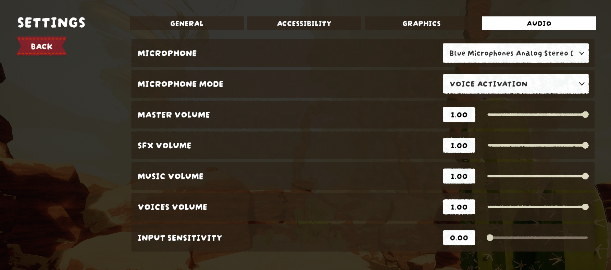

# SoundGate

Tired of your mic picking up keyboard clatter, fan noise, or your friends’ voices echoing through your headset? SoundGate cleans up your in-game voice chat so only your voice gets through.

This mod enables and configures several built-in features of the game’s VOIP system, most importantly a noise gate that blocks quiet background sounds from being transmitted.

The noise gate itself is controlled via an **Input Sensitivity** slider found within the Audio Settings Menu. 

Sounds below the Sensitivity's threshold won’t be transmitted over VOIP.

**Use:** Open **Settings → Audio → Input Sensitivity** and set the slider to your preferred value.
